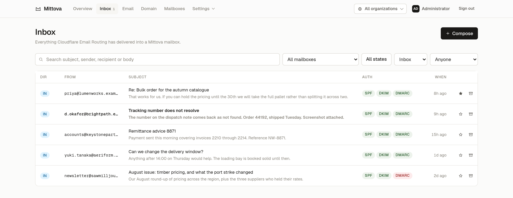
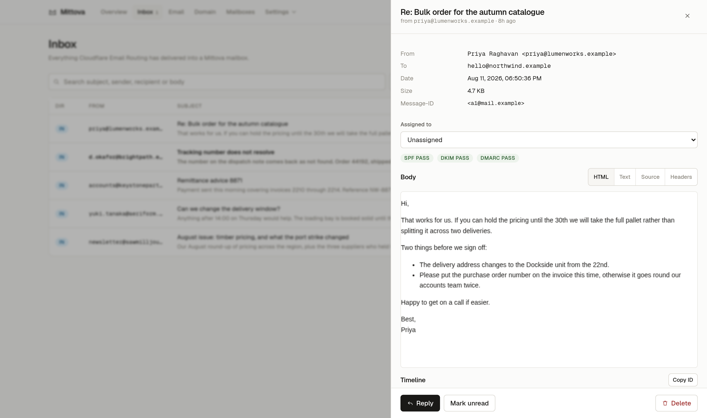
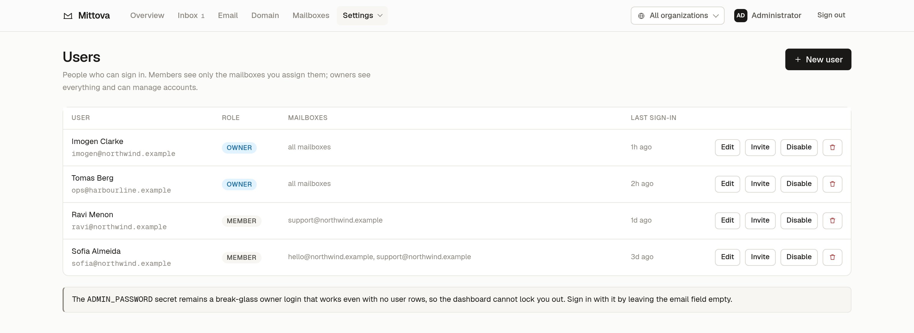
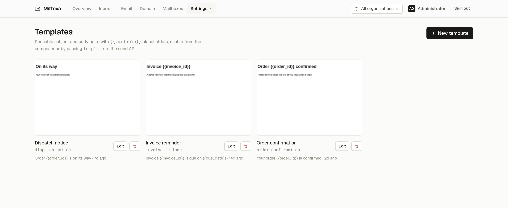
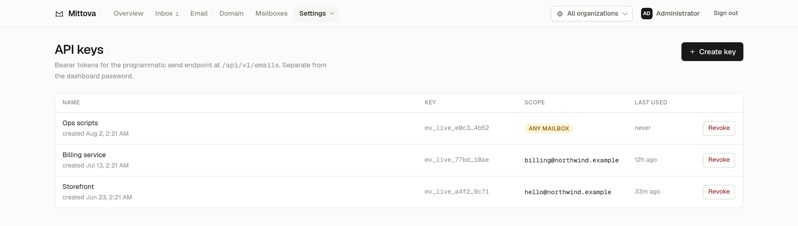

<p align="center">
  <picture>
    <source media="(prefers-color-scheme: dark)" srcset="logo-dark.svg">
    
  </picture>
</p>

<h1 align="center">Mittova</h1>

<p align="center">
  A real mailbox on your own domain — inbox, composer and send API —<br>
  on Cloudflare Workers, with no server to run and no mail stack to maintain.<br>
  <em>Your domain, your mailbox, your data.</em>
</p>

<p align="center">
  <a href="https://mittova.com"><b>mittova.com</b></a> &nbsp;·&nbsp;
  <a href="https://demo.mittova.com"><b>Live demo</b></a>
</p>

<p align="center">
  <a href="https://github.com/authegg/mittova/actions/workflows/check.yml"></a>
  <a href="LICENSE"></a>
  
</p>

---

Mittova runs a real mailbox on your own domain using Cloudflare's email stack. Inbound mail
arrives through Email Routing into a Worker, is parsed and stored in D1 and R2, and outbound mail
is sent through Cloudflare Email Service — DKIM-signed by your own domain.

There is no shared multi-tenant service in the middle. One deployment, one account, your data in
your own Cloudflare resources.

> Cloudflare **Email Sending is in beta**. Receiving through Email Routing is generally
> available; sending depends on a beta product, so treat it accordingly before putting a business
> on it.

**[Try the demo](https://demo.mittova.com)** — sign in with an empty email field and the password
`demo`. It resets on the hour, every address and message in it is fabricated, and sending is
disabled: it is the real dashboard against throwaway data, not a video.

<p align="center">
  <picture>
    <source media="(prefers-color-scheme: dark)" srcset="assets/screenshot-dark.png">
    
  </picture>
</p>

## What it does

- **Real mailboxes** on your domain — receive, read, reply with correct RFC 2822 threading
- **Rich text composer** with attachments, templates and per-user signatures
- **Shared inboxes** — several people on one address, with per-user read state and assignment
- **Organizations** — one deployment serves several unrelated clients, each seeing only its own
  domains, mailboxes, people, templates, contacts, suppressions, keys, webhooks and audit trail
- **Users and roles** — owners manage their organization, members only see mailboxes assigned to
  them, and a platform administrator can act in any organization
- **Deliverability built in** — live SPF/DKIM/DMARC verification, per-mailbox send caps,
  suppression list
- **Developer API** — bearer-token `POST /api/v1/emails`, plus HMAC-signed webhooks
- **Full-text search** over every message via SQLite FTS5
- **Multiple domains** from one deployment, added from the dashboard, each owned by an
  organization

<details>
<summary><b>More of the dashboard</b> — reading mail, users and roles, templates, API keys</summary>
<br>

Reading a message. Authentication results are shown per message, the raw source and headers are one
click away, and remote HTML renders in a sandboxed iframe so it cannot script the dashboard.

<picture>
  <source media="(prefers-color-scheme: dark)" srcset="assets/message-dark.png">
  
</picture>

Users and roles. Members see only the mailboxes assigned to them; owners manage the organization.

<picture>
  <source media="(prefers-color-scheme: dark)" srcset="assets/users-dark.png">
  
</picture>

Templates, reusable from the composer or by passing `template` to the send API.

<picture>
  <source media="(prefers-color-scheme: dark)" srcset="assets/templates-dark.png">
  
</picture>

API keys. Restricted keys may send as exactly one mailbox; only a SHA-256 hash is stored, so the
plaintext is shown once and never again.

<picture>
  <source media="(prefers-color-scheme: dark)" srcset="assets/keys-dark.png">
  
</picture>

</details>

## How it compares

Mittova sits in a gap. Hosted APIs send well but hold your mail and do not let you read it.
Classic self-hosted mail servers give you everything and a server to defend. Email Routing on its
own forwards mail but stores nothing.

<!-- comparison:start -->

|  | **Mittova** | Hosted API<br>(Resend, Postmark) | Classic self-hosted<br>(Mailcow, Mail-in-a-Box) | Email Routing<br>on its own |
|---|---|---|---|---|
| Where your mail lives | Your Cloudflare account | The vendor's infrastructure | Your server | Nowhere — it is forwarded |
| Server to run and patch | None | None | A VPS you own | None |
| IP reputation | Cloudflare's | The vendor's | Yours to build and defend | Cloudflare's |
| Read and reply to mail | Dashboard, with threading | Not offered | Yes, full mail stack | No |
| Programmatic send | `POST /api/v1/emails` | Yes | Your own SMTP | No |
| Several clients, one deployment | Organizations | One account each | One server each | No |
| Runs your own code on inbound | Yes, it is a Worker | Webhooks only | Yes, with plumbing | Yes, but nothing is stored |

<!-- comparison:end -->

The trade is deliberate: you are choosing to depend on Cloudflare rather than on a vendor or on a
server. If that dependency is unacceptable, a classic mail server is the honest answer.

## Requirements

- A domain using Cloudflare DNS
- A Cloudflare account with Workers, D1, R2 and KV available
- Node.js 20+

## Quick start

```bash
git clone https://github.com/authegg/mittova.git
cd mittova
npm install && npm --prefix dashboard install

npx wrangler login
npm run setup      # creates D1 + R2 + KV, writes wrangler.jsonc, sets the admin password
npm run deploy
```

Then, in the Cloudflare dashboard, enable **Email Routing** and **Email Sending** for your domain
(Compute → Email Service). Sign in at `https://mail.yourdomain.com` with an empty email field and
the password `npm run setup` printed.

`MAIL_DOMAIN` seeds the first domain on a fresh install. After that, domains live in the database
and further ones are added under **Domain → Add domain**; no redeploy.

Give each domain its Cloudflare zone id and Mittova will, with a `CF_API_TOKEN` present:

- **onboard Email Sending automatically** — Cloudflare writes the `cf-bounce` MX, SPF, DKIM and
  DMARC records itself, so the token never needs DNS edit permission
- create and remove the Email Routing rule for each mailbox on that domain

**Email Routing still has to be enabled by hand** in the Cloudflare dashboard
(Compute → Email Service). `POST /zones/{zone}/email/routing/enable` returns 403 even for a token
carrying every Email Routing permission group, so it cannot be automated.

### Token scope

`CF_API_TOKEN` needs exactly two policies, and nothing more:

| Resource | Permission |
|---|---|
| Account | Email Sending: Read, Write |
| All zones in the account | Email Routing Rules: Read, Edit — and Zone: Read |

Zone: Read is what lets Mittova resolve a zone id from a domain name, so adding a domain needs only
the domain. Scope it to all zones in the account rather than to named zones, or each new domain
means editing the token before the dashboard can onboard it.

Verify a replacement is properly narrow before using it — routing rules and sending should read,
DNS should be denied:

```bash
T=<your-cf-api-token>; Z=<your-zone-id>
curl -s -H "Authorization: Bearer $T" ".../zones/$Z/email/routing/rules"      # succeeds
curl -s -H "Authorization: Bearer $T" ".../zones/$Z/email/sending/subdomains" # succeeds
curl -s -H "Authorization: Bearer $T" ".../zones/$Z/dns_records"              # must be denied
```

`wrangler.jsonc` is gitignored — it holds ids specific to your deployment. The committed template
is `wrangler.example.jsonc`.

## Architecture

```
                 ┌──────────────── Cloudflare ────────────────┐
inbound mail ──► Email Routing ──► Worker email()  ──► D1 (metadata, FTS5)
                                          │            R2 (raw MIME, attachments)
                                          ▼
                                    webhooks (HMAC)

browser ──────► Worker fetch() ──► Hono API + React SPA (assets binding)
                                          │
outbound mail ◄── Email Sending ◄─────────┘   KV (sessions, rate limits)
```

A single Worker serves the SPA, the dashboard API, the public API, and the inbound mail handler.

| Path | What lives there |
|---|---|
| `src/index.ts` | Worker entry: `fetch`, `email`, `scheduled` |
| `src/api/` | Dashboard API (session auth) and `/api/v1` (bearer auth) |
| `src/services/` | Send, sanitiser, routing, domains, events, passwords |
| `src/email/ingest.ts` | Inbound parsing and storage |
| `src/db/schema.ts` | Drizzle schema; `migrations/` is generated from it |
| `migrations/meta/` | drizzle-kit bookkeeping. Not read at runtime; `wrangler d1 migrations apply` uses only the `.sql` files |
| `dashboard/` | React 19 + Vite SPA |

### R2 layout

One bucket, `mittova`, holds everything. Message content is namespaced by domain, so a lifecycle
rule, a per-domain export, or deleting one domain's data are all prefix operations rather than full
scans. Backups sit under a reserved prefix: they span every domain and belong to no single one, and
the leading underscore means no domain can collide with them.

```
mittova/<domain>/raw/<mailboxId>/<messageId>.eml   raw MIME, inbound only
mittova/<domain>/att/<messageId>/<attachmentId>    attachment bytes
mittova/_backups/<date>/<timestamp>.ndjson         database export
```

Keys are built in `src/services/storage.ts`; reads always use the key stored on the row, never a
recomputed one, so a layout change cannot orphan existing objects.

## Security

- **Outbound HTML is sanitised server-side** on every path, including API-key sends. Allowlisted
  tags, attributes and CSS properties; `http(s)`/`mailto` links only. Mail leaves DKIM-signed by
  your domain, so untrusted markup must never reach it.
- **Received HTML renders in a `sandbox=""` iframe**, so remote mail cannot script the dashboard.
- **Passwords** are PBKDF2-SHA256. workerd caps a single `deriveBits` call at 100k iterations, so
  the work factor is reached by chaining rounds.
- **API keys** are stored as SHA-256 hashes; plaintext is shown once and is not recoverable.
- **Authorisation** is centralised in `src/auth.ts`. A member with no mailboxes gets a `1 = 0`
  predicate, never an absent filter. Forbidden ids return 404 rather than 403 so existence is not
  disclosed.
- **Tenant isolation** rides on the same mechanism. An organization's owner is given that
  organization's mailboxes rather than a wildcard, so the filter every message query already
  applies is what holds the boundary. Rows in another tenant are excluded in the `WHERE` rather
  than checked after loading. The active organization travels as a request header, which the
  server honours only for platform administrators, so it is a view preference and never a grant.
  `scripts/tenant-isolation.mjs` stands up a second tenant against a running deployment and
  asserts sixteen ways across the boundary are refused.
- **Login is rate limited** per address and per IP.
- **Backups contain secrets.** The nightly export includes password hashes, API key hashes and
  webhook signing secrets, because a restore that omitted them would lock everyone out. Keep the
  R2 bucket private and treat the files as credentials.

Found a security issue? Please open
[a private advisory](https://github.com/authegg/mittova/security/advisories/new)
rather than a public issue. [SECURITY.md](SECURITY.md) describes what the threat
model assumes, which is worth reading before deciding whether something is a bug.

## Development

```bash
npm run dev                     # worker on :8787
npm --prefix dashboard run dev   # SPA on :5173, proxying /api

npm test                        # vitest
npm run check                   # typecheck both packages + tests
npm run db:generate             # regenerate migrations from src/db/schema.ts

npm run db:apply:local          # apply migrations to the local D1
npm run seed:demo               # fill it with demo content to click around in
```

`seed:demo` is what the screenshots above were taken from: two organizations, three mailboxes,
some mail. Everything in it is fabricated under `.example`, a reserved TLD, and the password and
key hashes are placeholders that match no credential. It refuses to run against a remote database,
because it deletes every row before inserting.

### Before you commit a migration

SQLite cannot always `ALTER TABLE`, so drizzle-kit sometimes emits
`CREATE __new_x` / `INSERT SELECT` / `DROP TABLE x`. It guards that with `PRAGMA foreign_keys=OFF`,
**which D1 does not honour** — the drop cascades and silently empties tables that reference the one
being replaced. This has bitten this project once, emptying a join table and revoking every user's
mailbox access without an error.

```bash
npm run db:generate
grep -n "DROP TABLE" migrations/<new-file>.sql   # must be empty, or hand-edit it
```

Appending a column instead of inserting it mid-table usually avoids the recreation entirely.

If you hand-write a migration rather than generating it, write its snapshot too. drizzle-kit
diffs `schema.ts` against `migrations/meta/<latest>_snapshot.json`, so a migration with no snapshot
is invisible to it and the next `db:generate` reproduces the whole thing as a fresh migration.
`npm run db:generate` printing `No schema changes, nothing to migrate` is the check that the chain
is intact.

### Upgrading from an earlier baseline

The migrations are squashed periodically: several files are replaced by the
single state they produced, and the journal is reset. `wrangler d1 migrations
apply` tracks what it has run **by tag**, so a deployment that already ran the
old `0000_baseline` will skip the new one and never gain the tables and columns
that were folded into it — reads then fail with `no such column`.

If your database predates a squash, compare it against `migrations/0000_baseline.sql`
and apply the difference by hand as a new migration before deploying. A fresh
install is unaffected: it gets the whole baseline.

## Limitations

- **Transactional mail only.** Cloudflare Email Service is not for bulk or marketing sending;
  Mittova deliberately has no broadcast feature.
- **Cloudflare DNS required** — Email Routing and Email Sending both depend on it.
- **Enabling Email Routing is a dashboard step.** Cloudflare returns 403 on
  `POST /zones/{zone}/email/routing/enable` for every scoped API token, so Mittova can onboard
  sending for a domain but not receiving. It links you to the right page and detects when you have
  done it.
- **Exports are per tenant; backups are not.** `GET /api/export` returns one
  organization's rows as NDJSON, with password hashes, API key hashes and
  webhook secrets redacted, so it can be handed to the client it belongs to.
  The nightly backup is the whole database and stays platform-administrator
  only, because restoring one client from it would mean restoring all of them.
- **An organization is not a separate database.** Isolation is enforced in the query layer against
  one D1 instance, which is the right trade for tenants you operate yourself. Clients who require
  their data to be physically separate want separate deployments.
- Email Sending is in beta at the time of writing. Email Routing, which is the receiving half, is
  generally available.

## Contributing

Issues and pull requests are welcome. [CONTRIBUTING.md](CONTRIBUTING.md) covers
getting it running, the commit conventions, and the three hazards worth knowing
before you touch a migration, the tenant boundary or the HTML sanitiser — each of
which has already caused an incident here.

## Licence

MIT — see [LICENSE](LICENSE).
